# StockSense

**A swing trading terminal for the Indian stock market, built with React and FastAPI.**

StockSense screens 2,100+ NSE-listed stocks against technical and fundamental filters, pulls in live market data via Angel One SmartAPI, and uses LLM-powered analysis to generate actionable trade setups — complete with entry points, targets, and stop losses.


> **Not investment advice.** StockSense is a personal engineering project, built to
> run locally. Its verdicts, entries, stop losses and targets are generated by
> statistical indicators and a language model, and can be wrong. The author is not
> a registered investment adviser or research analyst, and nothing this app
> produces is a recommendation to buy or sell any security. Do your own research.

---

## Demo

**Market overview** — live index cards, trending stocks with sparklines, top movers and
sentiment-tagged headlines.

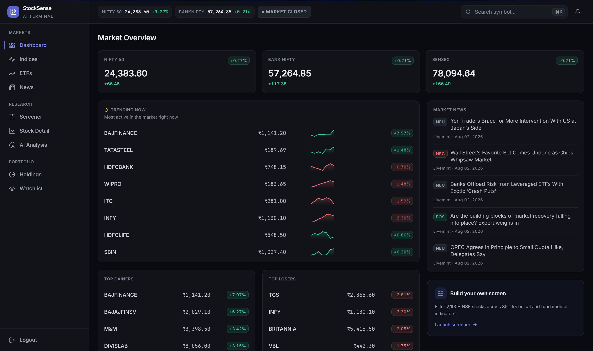

**AI analysis** — a verdict with confidence, a proposed swing setup, and the reasoning
behind it.

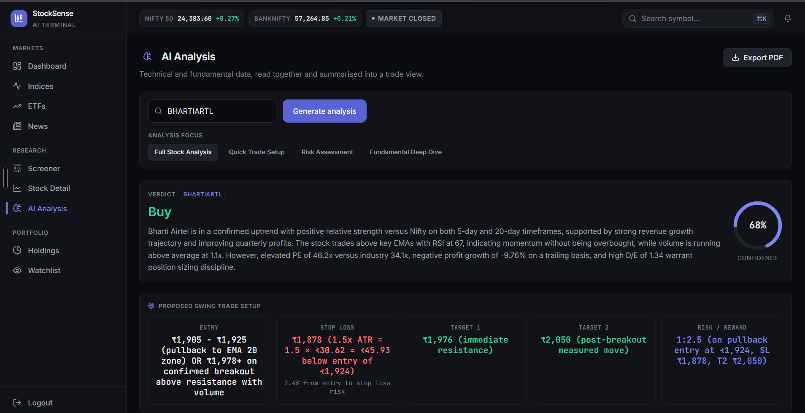

**AI levels drawn on the chart** — entry, stop loss and three targets rendered directly
onto the candles.

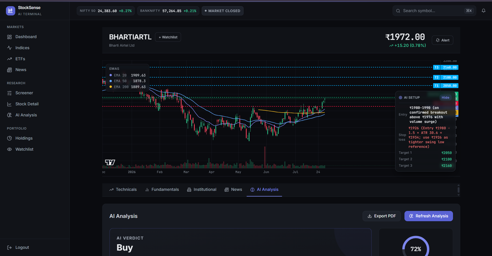

**Stock detail** — candlesticks with EMA 20/50/200, volume, and tabs for technicals,
fundamentals, institutional activity, news and AI analysis.

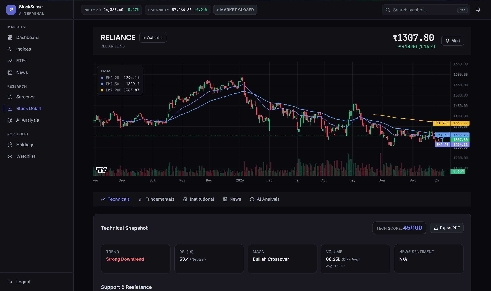

**Screener** — 40 technical and fundamental conditions across 2,100+ NSE stocks, streamed
over SSE with a live progress readout.

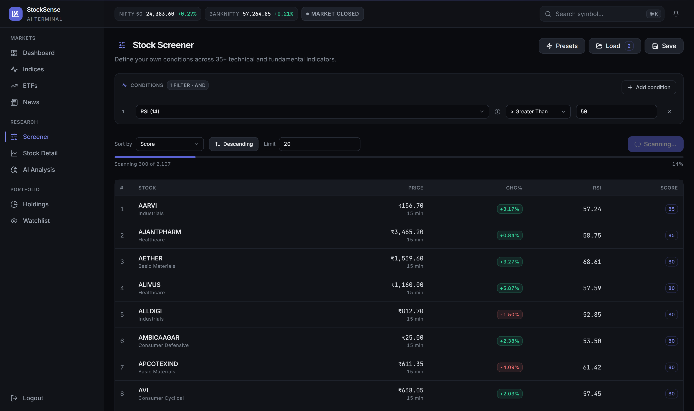

<details>
<summary>More screens</summary>

**Bull and bear cases, with red flags called out explicitly.**

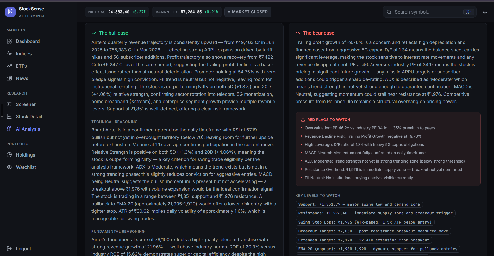

**Multi-timeframe verdicts** — intraday, swing, midterm and long term, each with its own
entry, stop and target.

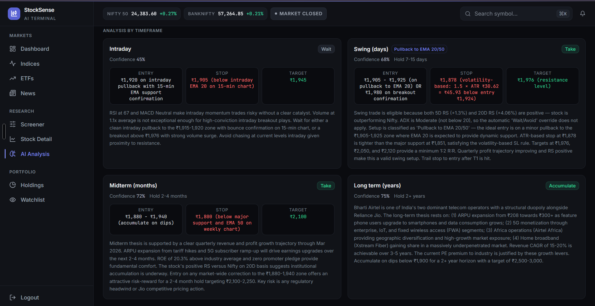

**Technical snapshot and detected chart patterns.**

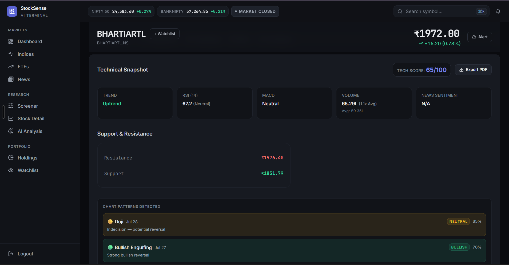

**Fundamental analysis** — ratios, growth, shareholding pattern.

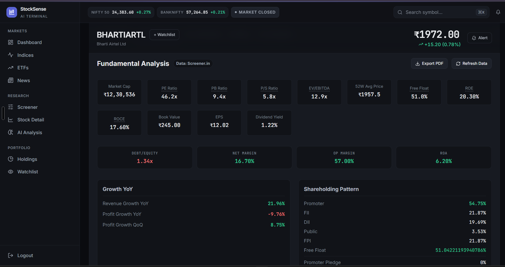

**Fundamental score card** with strengths and weaknesses.

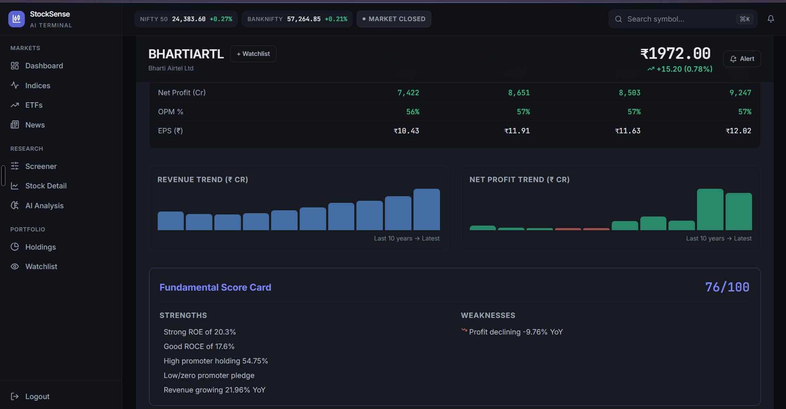

**Sector heatmap** — click a sector to open a pre-filtered screener.

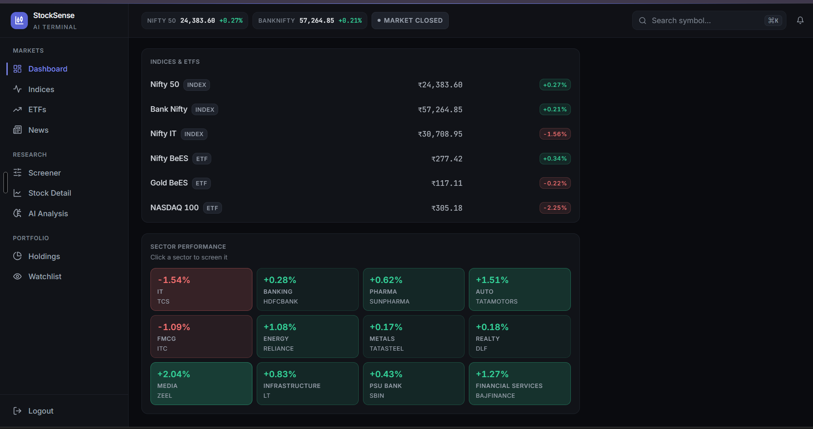

**Index analysis** — India VIX, market breadth, FII/DII flows.

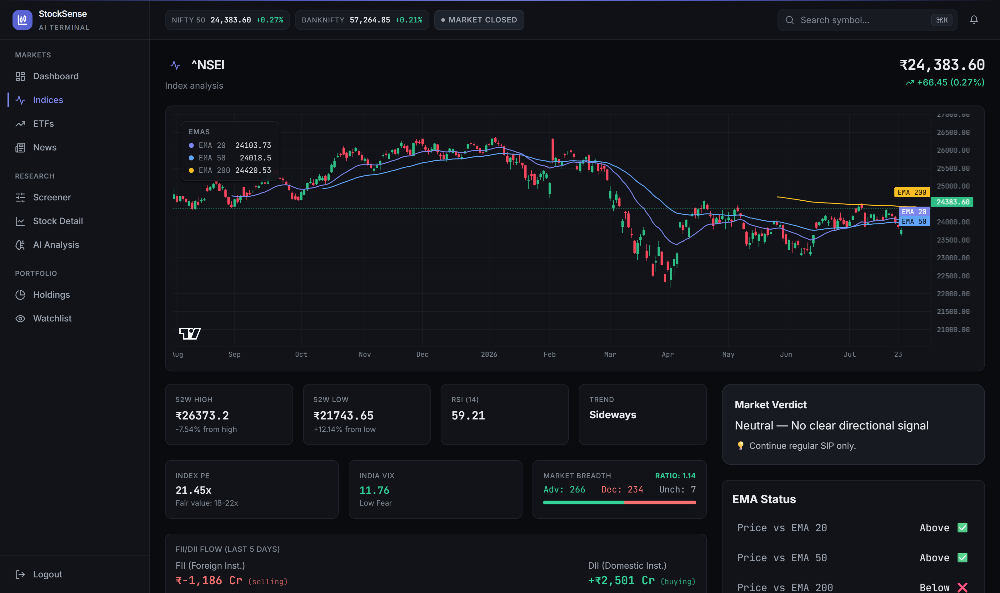

**ETF analysis** — NAV premium/discount, expense ratio, SIP guidance.

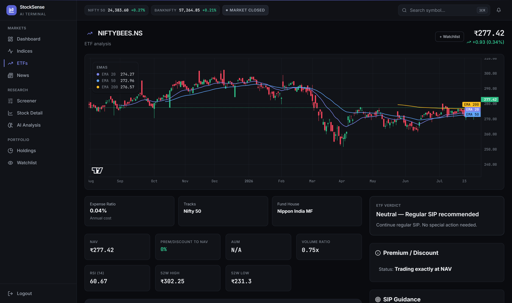

**News, grouped by sentiment.**

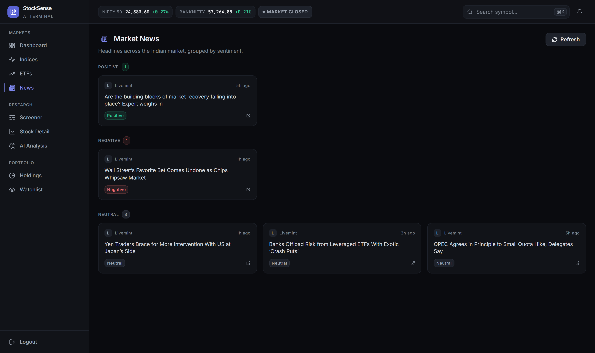

**Sign in.**

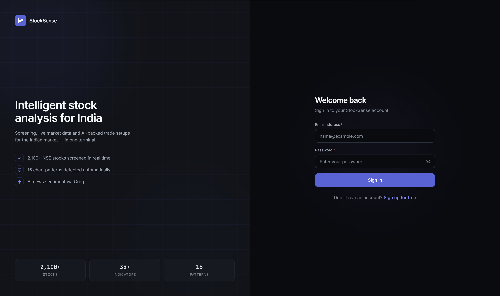

</details>

---

## Features

- **Multi-Condition Screener** — Scans 2,100+ NSE stocks across 40 indicators (EMA crossovers, RSI, MACD, ADX, Bollinger Bands, volume ratios) plus fundamental filters (P/E, P/B, ROE, debt-to-equity, revenue growth) and institutional activity (smart money score, promoter trends, bulk deals). Results stream in real-time via SSE with a live progress bar.
- **AI-Powered Analysis** — Aggregates technical, fundamental, and news data into a structured prompt sent to Claude. Returns bull/bear cases, swing trade setups (entry, target, stop loss), risk factors, and multi-timeframe verdicts — all rendered in a formatted report.
- **Interactive Charts** — TradingView Lightweight Charts with candlestick data, EMA overlays, and AI-generated trade levels (entry/target/SL) drawn directly on the chart.
- **Live Market Data** — Angel One SmartAPI WebSocket connection for real-time prices during market hours, with automatic yfinance fallback for after-hours and weekends.
- **Sector Heatmap** — Visual grid of sector performance with color-coded gains/losses. Click any sector to jump to a pre-filtered screener view.
- **Chart Pattern Detection** — Scans recent candlesticks for 16 patterns (Doji, Hammer, Engulfing, Morning/Evening Star, Three White Soldiers, etc.) with confidence scores and bullish/bearish classification.
- **Stock Deep Dive** — Dedicated detail page with tabs for Technical Snapshot (EMA levels, RSI, MACD, ADX, Stochastic RSI, ATR, OBV), Fundamental Analysis (key ratios, growth metrics, shareholding breakdown, score card), and full AI Analysis.
- **Portfolio Tracker** — Track holdings, monitor real-time P&L, and get AI-driven rebalancing suggestions.
- **Smart Alerts** — Set price-based alerts on any stock; a background checker polls prices and triggers desktop notifications via the browser Notification API.
- **Index & ETF Analysis** — Dedicated views for Nifty 50, Sensex, and major ETFs with FII/DII flow data, market breadth, P/E valuation, and AI-generated market verdicts.
- **News Feed with Sentiment** — Aggregates market news from Google News and publisher RSS feeds, with optional Groq-powered sentiment classification (bullish/bearish/neutral badges).
- **Command Palette** — `Ctrl+K` to fuzzy search across all 2,100+ stocks instantly.

---

## Tech Stack

| Layer | Technologies |
|---|---|
| **Frontend** | React 18, Vite, Zustand, Tailwind CSS, Framer Motion, Lightweight Charts |
| **Backend** | FastAPI, SQLAlchemy (SQLite), APScheduler, Pandas |
| **Market Data** | Angel One SmartAPI (primary), yfinance (fallback) |
| **AI** | Anthropic Claude (analysis), Groq (news sentiment) |
| **Technical Analysis** | pandas-ta, custom pattern detection engine |
| **Data Sources** | NSE (institutional data, bulk deals), RSS feeds |

---

## Architecture

> For the full picture — request lifecycle, every service's responsibility, the
> database schema, and how the four AI analysis types differ — see
> **[docs/ARCHITECTURE.md](docs/ARCHITECTURE.md)**.

```
┌─────────────────────────────────────────────────────────┐
│                    React Frontend                       │
│  Dashboard · Screener · Stock Detail · AI Analysis      │
│  Portfolio · Watchlist · News · Index/ETF · Alerts       │
└──────────────┬──────────────────────┬───────────────────┘
               │ REST + SSE           │ WebSocket
               ▼                      ▼
┌─────────────────────────────────────────────────────────┐
│                   FastAPI Backend                        │
│                                                         │
│  ┌──────────┐  ┌──────────────┐  ┌───────────────────┐  │
│  │ Screener │  │ AI Service   │  │ Market Data       │  │
│  │ Engine   │  │ (Claude)     │  │ (Angel One /      │  │
│  │ (2100+)  │  │              │  │  yfinance)        │  │
│  └──────────┘  └──────────────┘  └───────────────────┘  │
│  ┌──────────┐  ┌──────────────┐  ┌───────────────────┐  │
│  │ Technical│  │ Pattern      │  │ News + Sentiment  │  │
│  │ Analysis │  │ Detection    │  │ (Groq / RSS)      │  │
│  └──────────┘  └──────────────┘  └───────────────────┘  │
│  ┌──────────┐  ┌──────────────┐                         │
│  │ Index/ETF│  │ Institutional│                         │
│  │ Analysis │  │ Data (NSE)   │                         │
│  └──────────┘  └──────────────┘                         │
│                                                         │
│                  SQLite (stocksense.db)                  │
└─────────────────────────────────────────────────────────┘
```

---

## Getting Started

### Prerequisites

- **Python 3.12 or 3.13.** The pinned `pandas-ta` needs 3.12+, and it depends on
  `numba`, which has no wheel for 3.14 yet and fails to build from source.
  Check with `python --version` (on Windows, `py -3.12` picks a specific version).
- **Node.js 20+** (React Router 7 requires it). Check with `node --version`.
- An Anthropic API key for the AI analysis features. Everything else works
  without one.

Every step below starts from the **project root** (the `StockSense-1` folder).

### 1. Clone the repo

```bash
git clone https://github.com/Shrey-Vhr/StockSense-1.git
cd StockSense-1
```

### 2. Configure environment variables

The `.env` file goes in the **project root**, not in `backend/`.

```bash
# macOS / Linux / Git Bash
cp .env.example .env

# Windows Command Prompt
copy .env.example .env
```

Then open `.env` and set:

- **`SECRET_KEY` (required).** The backend refuses to start without it, and
  rejects placeholders and anything shorter than 32 characters. Generate one
  and paste it in:

  ```bash
  python -c "import secrets; print(secrets.token_urlsafe(48))"
  ```

- **`ANTHROPIC_API_KEY`** for the AI features. Replace the `sk-ant-...`
  placeholder with your key, or leave it as is to run without AI.

Everything else is optional: leave the Angel One fields blank and the app uses
yfinance for market data. See [Environment Variables](#environment-variables).

### 3. Backend setup

```bash
cd backend
python -m venv venv

# macOS / Linux / Git Bash
source venv/bin/activate
# Windows Command Prompt
venv\Scripts\activate

pip install -r requirements.txt
```

### 4. Frontend setup

From the project root, in a second terminal:

```bash
cd frontend
npm install
```

No frontend `.env` is needed: the API address defaults to
`http://localhost:8000/api`. Set `VITE_API_URL` in `frontend/.env` only if you
run the backend somewhere else.

### 5. Run the app

**Option A — two terminals:**

```bash
# Terminal 1, from the project root
cd backend
source venv/bin/activate        # Windows: venv\Scripts\activate
uvicorn main:app --reload

# Terminal 2, from the project root
cd frontend
npm run dev
```

**Option B — Windows one-click** (after steps 1–4), from the project root:

```bash
start.bat
```

Open **http://localhost:5173** and create an account on the sign-up page. The
API runs at **http://localhost:8000**. The database is a local SQLite file
(`backend/stocksense.db`), created automatically on first start.

### 6. Install the git hooks (contributors)

From the project root (needs `sh`, which Git for Windows includes as Git Bash):

```bash
sh scripts/install-hooks.sh
```

Blocks log files, `.env`, databases and common API-key patterns from being
committed. Hooks live in `.git/hooks/`, which git does not track, so they do not
arrive with a clone and must be installed once.

### 7. Run the tests

From the project root, with the backend's virtual environment active:

```bash
cd backend
pip install -r requirements-dev.txt
python -m pytest
```

The suite covers the security guarantees in [SECURITY.md](SECURITY.md): per-user
data isolation, rate limits, input caps, account lockout, error hygiene and the
Angel One retry guard. It uses a throwaway SQLite database and blank API keys,
so it needs no `.env`, makes no paid API calls and never logs in to a broker.
CI runs it on every push along with the frontend lint and build.

---

## Environment Variables

Create a `.env` file in the project root (see `.env.example`):

| Variable | Required | Description |
|---|---|---|
| `ANTHROPIC_API_KEY` | Yes | Claude API key. Required for every AI feature |
| `GROQ_API_KEY` | No | Groq API key for news sentiment analysis |
| `ANGEL_ONE_API_KEY` | No | Angel One SmartAPI key for live market data |
| `ANGEL_ONE_CLIENT_ID` | No | Angel One client ID |
| `ANGEL_ONE_PASSWORD` | No | Angel One login PIN (MPIN) |
| `ANGEL_ONE_TOTP_SECRET` | No | Angel One TOTP secret for auto-login |
| `SECRET_KEY` | Yes | JWT signing secret. Must be 32+ characters — the app refuses to start otherwise. Generate one with `python -c "import secrets; print(secrets.token_urlsafe(48))"` |
| `DATABASE_URL` | No | Database URL (defaults to SQLite) |

AI analysis requires `ANTHROPIC_API_KEY`. Everything else is optional — the app falls
back to yfinance for market data and RSS for news.

---

## Project Structure

```
StockSense/
├── backend/
│   ├── main.py                    # FastAPI app entry point & startup tasks
│   ├── config.py                  # Pydantic settings & env loading
│   ├── database.py                # SQLAlchemy engine & session setup
│   ├── rate_limit.py              # In-memory rate limiting for auth, AI & scans
│   ├── tests/                     # Pytest suite for the security guarantees
│   ├── models/                    # DB models (User, Stock, Alert, Portfolio, etc.)
│   ├── routers/                   # API route handlers
│   │   ├── auth.py                # JWT authentication (register/login)
│   │   ├── stocks.py              # Stock data, gainers/losers, sector performance
│   │   ├── analysis.py            # Technical & fundamental analysis endpoints
│   │   ├── screener.py            # Multi-condition screener with SSE streaming
│   │   ├── portfolio.py           # Portfolio CRUD & P&L tracking
│   │   ├── ai.py                  # AI analysis generation endpoints
│   │   ├── alerts.py              # Price alert management
│   │   ├── watchlist.py           # Watchlist management
│   │   └── news.py                # Market news feed
│   ├── services/                  # Core business logic
│   │   ├── ai_service.py          # Claude prompt engineering & response parsing
│   │   ├── screener_service.py    # 2,100+ stock screening engine (40 indicators)
│   │   ├── technical_analysis.py  # EMA, RSI, MACD, ADX, Bollinger, ATR, OBV
│   │   ├── pattern_service.py     # Candlestick pattern detection (16 patterns)
│   │   ├── market_data.py         # Price data fetching & caching
│   │   ├── institutional_service.py # NSE scraping for shareholding & bulk deals
│   │   ├── index_etf_analysis.py  # Index/ETF analysis with FII/DII flows
│   │   ├── news_service.py        # RSS aggregation with Groq sentiment
│   │   ├── angel_one_service.py   # Angel One SmartAPI integration
│   │   ├── websocket_service.py   # Real-time price broadcasting
│   │   └── alert_checker.py       # Background alert monitoring loop
│   ├── data/
│   │   └── nse_stocks.json        # Universe of 2,100+ NSE stock symbols
│   └── requirements.txt
├── frontend/
│   ├── src/
│   │   ├── App.jsx                # Router setup with animated page transitions
│   │   ├── pages/                 # Route-level components
│   │   │   ├── Dashboard.jsx      # Market overview, indices, heatmap, trending
│   │   │   ├── StockDetail.jsx    # Full stock analysis (technical/fundamental/AI)
│   │   │   ├── Screener.jsx       # Multi-condition stock screener UI
│   │   │   ├── AIAnalysis.jsx     # Standalone AI analysis page
│   │   │   ├── Portfolio.jsx      # Portfolio tracking & P&L
│   │   │   ├── IndexDetail.jsx    # Index analysis (Nifty 50, Sensex)
│   │   │   ├── ETFDetail.jsx      # ETF analysis
│   │   │   └── ...
│   │   ├── components/            # Reusable UI components
│   │   │   ├── Dashboard/         # SectorHeatmap, TrendingSection
│   │   │   └── Layout/            # Sidebar, Header, CommandPalette
│   │   ├── hooks/                 # useAuth, useDebounce, useCountUp, useNotifications
│   │   ├── store/                 # Zustand global state
│   │   └── utils/                 # Axios API client
│   └── package.json
├── docs/                          # Architecture, decision records, screenshots
├── scripts/                       # Pre-commit hook that blocks secrets & logs
├── .github/                       # CI security checks & Dependabot
├── .env.example                   # Environment variable template
├── start.bat                      # One-click launcher (Windows)
├── SECURITY.md                    # Security model & how to report issues
└── README.md
```

---

## Scope and limitations

StockSense is built to run on `localhost` for a single user. It is **not hardened
for public deployment**, and the following are known and deliberate:

| | |
|---|---|
| **JWT in `localStorage`** | 7-day expiry with no server-side revocation — logging out clears the browser but the token stays valid until it expires. `httpOnly` cookies plus a revocation list would be the fix for a hosted deployment. |
| **In-memory rate limits** | Login, registration, AI, screener and pattern-scan limits live in process memory (`backend/rate_limit.py`): they reset on restart and are not shared between workers. Right for one local process; a hosted deployment would want Redis or a gateway. |
| **CORS is pinned to localhost** | Deploying means adding real origins, and never `*` alongside `allow_credentials=True`. |
| **SQLite** | Fine for one user; not intended for concurrent writers. |
| **No CSP header** | Nothing sets one; it would need to come from whatever serves the built frontend. |
| **Dev-tool npm advisories** | `npm audit` still flags Vite 5 and Tailwind 3 (via esbuild, chokidar, micromatch). These run only on the developer's machine during `npm run dev`/`build` and are not in the shipped bundle. Clearing them needs the Vite 8 and Tailwind 4 major migrations. |

What *is* covered: every API router except auth requires a token; passwords are
bcrypt-hashed and at least 8 characters; deactivated accounts are refused; every
user-data query (portfolio, watchlists, alerts, saved screeners, pattern scans)
is scoped by owner; login, registration and every route that spends API credit
or scans the market are rate-limited and size-capped; error responses never echo
internal exception text; news headlines are fenced off as untrusted text in AI
prompts; all database access goes through the SQLAlchemy ORM; and Python
dependencies are pinned and audited in CI. See [SECURITY.md](SECURITY.md).

---

## Contributing

1. Fork the repo
2. Create a feature branch (`git checkout -b feature/your-feature`)
3. Commit your changes (`git commit -m "Add your feature"`)
4. Push to the branch (`git push origin feature/your-feature`)
5. Open a Pull Request

---

## License

This project is licensed under the MIT License — see the [LICENSE](LICENSE) file for details.
