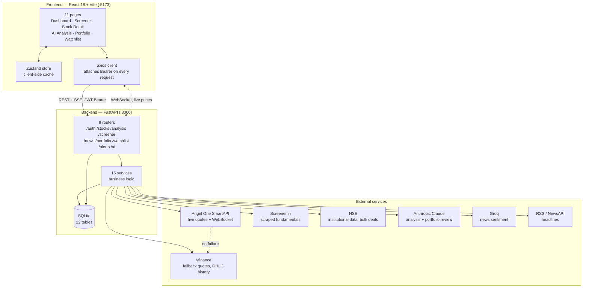
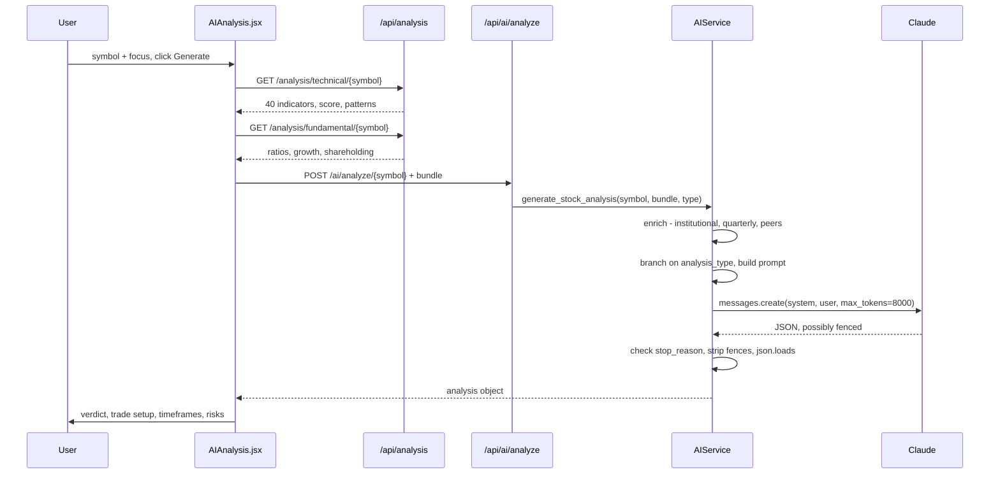
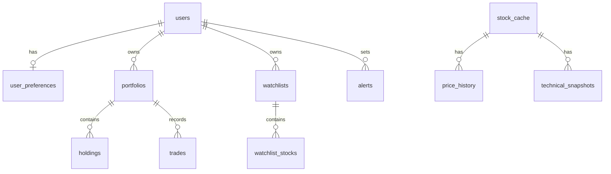

# StockSense — Architecture

A swing-trading terminal for the Indian market. Screens 2,100+ NSE stocks against 40
indicators, pulls live prices, and asks an LLM to turn the numbers into a trade view.

React 18 + Vite frontend, FastAPI backend, SQLite. Runs locally, single user.

---

## 1. System overview



**Auth boundary.** Every router except `/auth` sits behind `Depends(get_current_user)`.
JWT, HS256, 7-day expiry, held in `localStorage`.

**Market data has a fallback chain.** Angel One SmartAPI is tried first; if it is not
connected the call drops to yfinance. Live prices during market hours arrive over a
WebSocket; outside market hours a polling loop stands in.

---

## 2. Data flow — one AI analysis, end to end

What happens between clicking **Generate analysis** and text appearing on screen.



Step by step:

1. **Two data fetches first.** The frontend gathers technical and fundamental data itself,
   then posts them to the AI endpoint. The AI service never re-fetches market data — it is
   handed a bundle. That keeps the LLM call a pure transform.
2. **The router maps label to key.** `Full Stock Analysis` → `full`,
   `Quick Trade Setup` → `trade_setup`, `Risk Assessment` → `risk`,
   `Fundamental Deep Dive` → `fundamental`.
3. **The service enriches.** Before prompting it assembles three extra blocks:
   `institutional_trend` (promoter activity, FII trend, pledge), `quarterly_trajectory`
   (revenue and profit by quarter), and `peer_comparison` (industry PE and ROE).
4. **Branch, then prompt.** See section 5 — the branch decides the analyst persona and which
   numbers go into the prompt.
5. **One Claude call**, `max_tokens=8000`, `temperature=0.2`.
6. **Guarded parse.** If `stop_reason == "max_tokens"` the service returns a plain message
   rather than letting a truncated payload fail as a JSON syntax error. Markdown fences are
   stripped before `json.loads`.
7. **The frontend renders** verdict, confidence ring, trade-setup tiles, four timeframes,
   bull and bear cases, red flags — plus a disclaimer.

**The screener flows differently.** `GET /screener/stream` is Server-Sent Events: the engine
yields one frame per matching stock, a `progress` frame periodically, and a final `summary`
frame. The frontend reads it with `fetch` and a `ReadableStream` rather than `EventSource`,
because `EventSource` cannot send an `Authorization` header.

---

## 3. Modules and their single responsibility

### Services — `backend/services/`

| Service | Lines | Responsibility |
|---|---:|---|
| `screener_service.py` | 864 | The screening engine. Owns `INDICATOR_CATALOGUE` (40 indicators across 7 groups) and `run_stream`, which evaluates conditions over the universe and yields SSE frames. |
| `technical_analysis.py` | 461 | Computes indicators from OHLC — RSI, MACD, ADX, EMAs, ATR, OBV, Stochastic — and the 0–100 technical score. |
| `fundamental_analysis.py` | 41 | Thin wrapper returning the fundamental bundle for a symbol. |
| `screener_in_service.py` | 952 | Scrapes Screener.in for ratios, quarterly results and peers. Rate-limited. |
| `institutional_service.py` | 491 | NSE institutional data — FII/DII trend, bulk deals, promoter activity, smart-money score. |
| `pattern_service.py` | 1117 | Candlestick and chart pattern detection — 16 patterns with confidence scores. |
| `market_data.py` | 438 | Quotes and OHLC history. Owns the Angel One → yfinance fallback and TTL caching. |
| `angel_one_service.py` | 188 | SmartAPI session — login, TOTP, token lookup, quote fetch. |
| `angel_one_websocket.py` | 104 | Raw SmartAPI WebSocket client. |
| `websocket_service.py` | 131 | Connection manager, plus the polling fallback when the socket is unavailable. |
| `price_broadcaster.py` | 49 | Fans one incoming tick out to every subscribed client. |
| `index_etf_analysis.py` | 523 | Index and ETF views — VIX, breadth, FII/DII flows, NAV premium, verdicts. |
| `news_service.py` | 524 | Fetches headlines from RSS/NewsAPI and classifies sentiment via Groq. |
| `ai_service.py` | 623 | Every LLM call. Prompt construction, the four analysis branches, response parsing. |
| `alert_checker.py` | 81 | Background loop comparing live prices against stored alert thresholds. |

### Routers — `backend/routers/`

One router per domain, each deliberately thin: validate, call a service, return.

`auth` · `stocks` · `analysis` · `screener` · `news` · `portfolio` · `watchlist` · `alerts` · `ai`

### Frontend — `frontend/src/`

| Path | Responsibility |
|---|---|
| `pages/` | 11 route components, one per screen. |
| `components/ui/` | 16 shared primitives. Every page composes these; no page defines its own button or card. |
| `styles/tokens.css` | Design tokens as RGB triplets. Single source of colour, elevation and motion. |
| `lib/` | `format` (numbers, currency, direction) · `chartTheme` · `motion` · `cn` · `pdfTemplates` |
| `store/useStore.js` | Zustand store — client cache so navigation does not refetch. |
| `utils/api.js` | axios instance. Attaches the Bearer token; handles 401 by logging out. |

---

## 4. Database — SQLite, 12 tables



**Identity**

- `users` — email, bcrypt `password_hash`, name, `is_active`.
- `user_preferences` — one row per user: default watchlist, notification settings, theme.

**Market reference data** — shared, not per-user

- `stock_cache` — the universe. Symbol, name, sector, industry, market cap.
- `price_history` — daily OHLCV, keyed `(symbol, date)`.
- `technical_snapshots` — computed indicators at a point in time, keyed `(symbol, timestamp)`.

**User data** — all owner-scoped

- `portfolios` — one per user, named.
- `holdings` — symbol, quantity, average buy price, buy date, notes.
- `trades` — BUY/SELL log, with realised `pnl` on sells.
- `watchlists` / `watchlist_stocks` — named lists and their symbols with notes.
- `alerts` — symbol, type, condition, threshold, `is_triggered`, `notified`.
- `saved_screeners` — name, description, conditions as JSON text, sort preferences.

There is no ORM-level multi-tenancy. Isolation is enforced by every query filtering on
`user_id`, or on a `portfolio_id` already resolved from the current user.

---

## 5. The four AI analysis types

All four run through one function — `AIService.generate_stock_analysis` — and hit the same
branch point:

```
ai_service.py:194   if   analysis_type == 'trade_setup'
ai_service.py:277   elif analysis_type == 'risk'
ai_service.py:374   elif analysis_type == 'fundamental'
ai_service.py:458   else                                  # full
```

**All four request an identical JSON schema** — the same 25 keys, including `verdict`,
`confidence`, `trade_setup`, `timeframes`, `bull_case`, `bear_case` and `red_flags`. That is
deliberate: the frontend renders one shape regardless of which type ran, so the UI needs no
per-type branching.

What actually differs is the **persona** and **which numbers reach the prompt**:

| Type | UI label | Persona | Data emphasised |
|---|---|---|---|
| `full` | Full Stock Analysis | Market analyst | Everything — price, all technicals, all fundamentals, patterns, volume, market regime, sector |
| `trade_setup` | Quick Trade Setup | "Trading desk analyst. No fluff." | Trend, RSI, MACD, support, resistance, pattern. No valuation |
| `risk` | Risk Assessment | "Risk manager. Be brutally honest about what can go wrong." | Trend, RSI, ADX, both scores, promoter holding, support |
| `fundamental` | Fundamental Deep Dive | "Fundamental analyst (CFA). Ignore short-term price action." | PE, ROE, D/E, revenue and profit growth, promoter, market cap |

Three blocks are appended to **every** prompt regardless of type: institutional trend,
quarterly trajectory, and peer comparison.

**One rule lives in the system prompt rather than the branches:** if ADX is below 20 (a choppy
market) or relative strength versus Nifty is negative, the swing verdict is forced to *Wait*
or *Avoid* no matter how strong the fundamentals look.

### Other LLM paths

| Endpoint | Method | Model |
|---|---|---|
| `POST /ai/analyze/{symbol}` | `generate_stock_analysis` | `claude-sonnet-4-6` |
| `POST /ai/portfolio-review` | `analyze_portfolio` | `claude-haiku-4-5` |
| `GET /ai/explain/{indicator}` | `explain_indicator` | `claude-haiku-4-5` |
| internal | `generate_swing_screener_insights` | `claude-haiku-4-5` |

Deep analysis uses Sonnet; the short, cheap calls use Haiku.

---

## 6. Worth knowing

- **Gemini is configured but never called.** `GEMINI_API_KEY` exists and
  `google-generativeai` is installed, but no code path invokes it. Claude handles all
  analysis; Groq handles news sentiment only.
- **`pandas-ta` pins the Python version.** It pulls `numba`, which has no wheel for Python
  3.14. Use 3.10–3.13.
- **No test suite exists.** `backend/scripts/` holds ad-hoc dev scripts, not tests.
- **SQLite is single-writer.** Fine for one user; the first thing to replace if this ever
  serves concurrent traffic.
- **`PatternScanner.jsx` is complete but unrouted.** Its backend endpoints are live — a
  finished feature waiting on a route.
